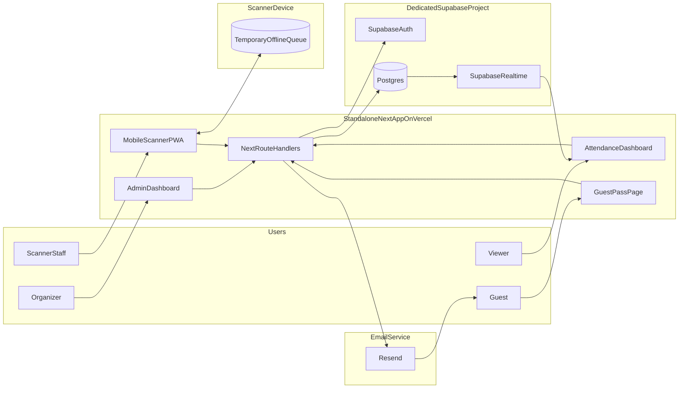
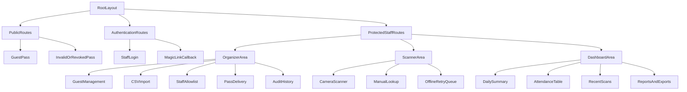
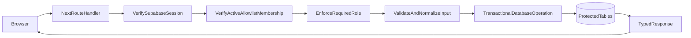
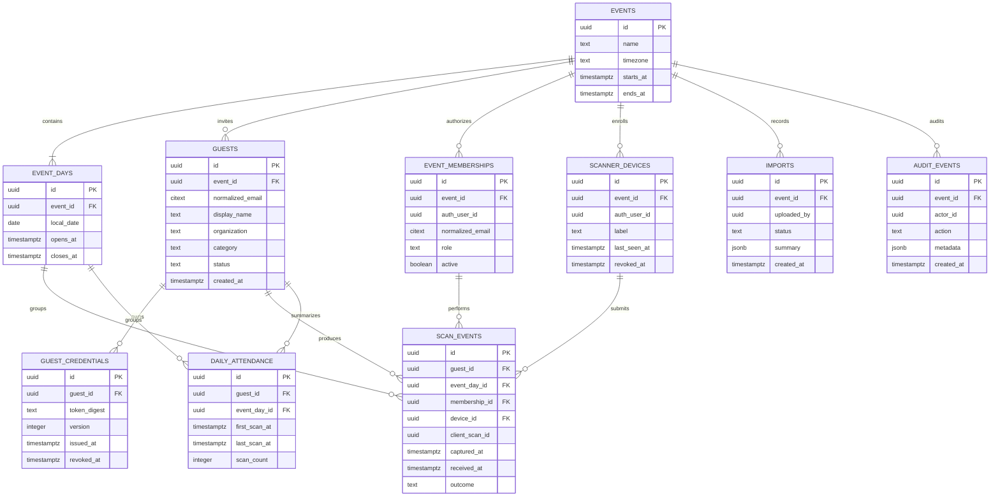
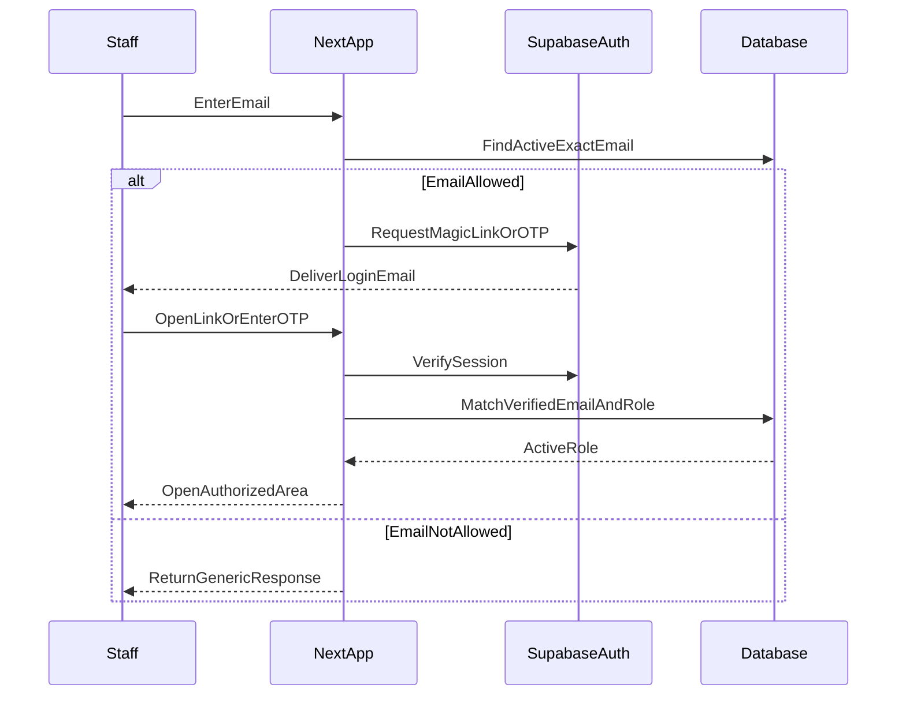
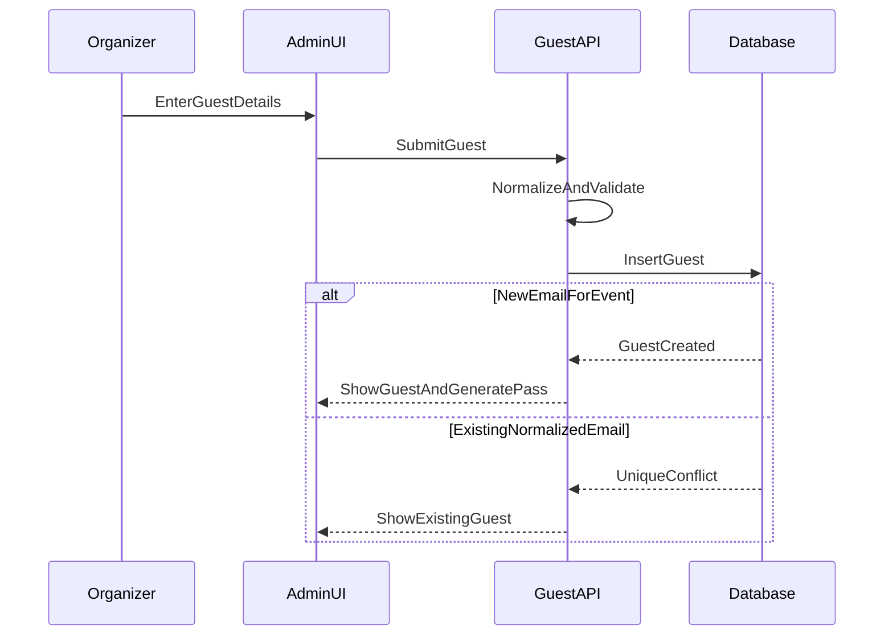
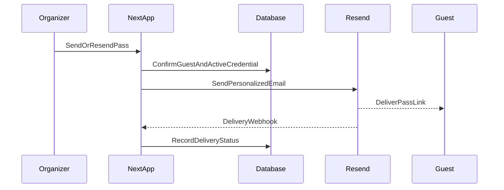
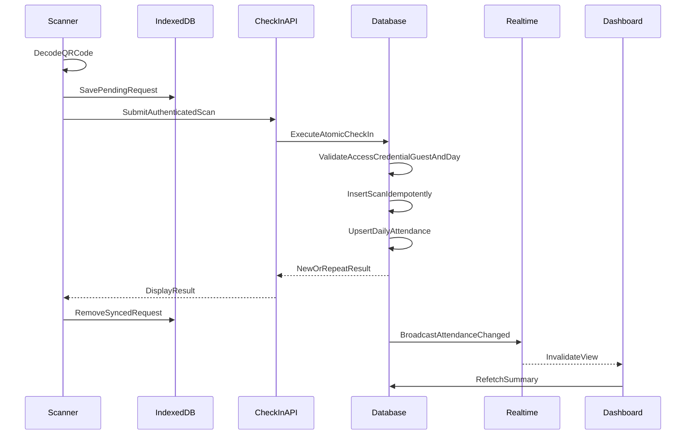
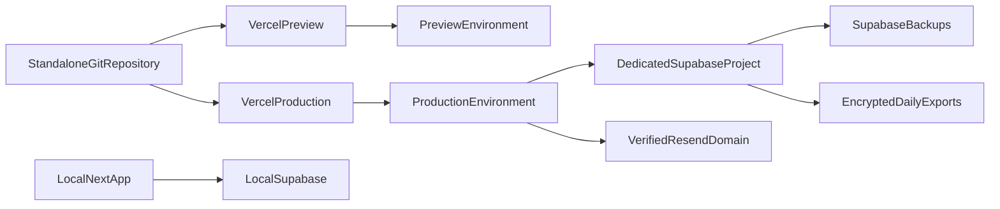

# GTP Guest Check-In Platform — Master Specification

**Status:** Draft v1  
**Target event:** 12–15 October 2026  
**Event timezone:** Asia/Kuala_Lumpur  
**Document purpose:** Canonical product and architecture reference before implementation planning or coding.

---

## 1. Product Summary

The GTP Guest Check-In Platform is a standalone website for managing invited conference guests and recording their attendance.

Authorized SCPH staff will:

1. Sign in through an approved-email allowlist.
2. Add or import invited guests.
3. Generate one secure QR pass for each guest.
4. Email, copy, download, or print those passes.
5. Scan the same QR pass on any of the four event days.
6. Monitor attendance through a live dashboard.

The platform is operationally and technically separate from the existing SCPH website, GTP marketing website, MPN platform, Sanity CMS, and their databases.

---

## 2. Confirmed Scope and Decisions

| Area | Decision |
| --- | --- |
| Application | Standalone Next.js application |
| Repository | New independent project under `Work/gtp-check-in` |
| Deployment | Separate Vercel project |
| Backend | Dedicated Supabase project |
| Database | Supabase Postgres |
| Staff authentication | Passwordless email magic link or OTP |
| Staff authorization | Exact-email allowlist stored in Postgres |
| Guest authentication | None required |
| Guest identity key | Normalized email, unique within an event |
| QR validity | One active QR per guest, reusable across all four days |
| Repeat scans | Allowed and retained |
| Daily attendance | One attendance summary per guest per event day |
| Live updates | Supabase Realtime with authoritative refetch |
| Email delivery | Resend |
| Expected scale | Up to 500 guests and five simultaneous scanners |
| Connectivity | Normally online with a short offline retry queue |
| Event dates | 12, 13, 14 and 15 October 2026 |
| Event timezone | Asia/Kuala_Lumpur |

---

## 3. Goals

### 3.1 Primary goals

- Prevent duplicate guest records based on normalized email.
- Restrict the platform to explicitly approved SCPH staff.
- Let authorized team members create and manage invitees.
- Generate a secure, shareable QR pass for every guest.
- Reuse the same pass throughout all four event days.
- Record every legitimate scan, including re-entry and repeat scans.
- Display accurate daily attendance immediately after check-in.
- Preserve an auditable history of administrative and attendance activity.
- Continue capturing scans during brief connectivity interruptions.
- Provide manual lookup and operational fallbacks.

### 3.2 Non-goals for version 1

- Integration with the SCPH, GTP marketing, MPN, or Sanity systems.
- Public guest registration.
- Guest accounts or guest passwords.
- Payment or ticket sales.
- Seat allocation.
- Session-level access control.
- Facial recognition or identity document scanning.
- Fully offline roster validation.
- Native iOS or Android applications.
- Direct WhatsApp API delivery.
- Apple Wallet or Google Wallet passes.

These may be reconsidered after the first production release.

---

## 4. User Roles

### 4.1 Organizer

Can:

- Manage the staff allowlist and roles.
- Add, edit, deactivate, restore and search guests.
- Import guests from CSV.
- Generate, revoke and reissue QR credentials.
- Send or resend guest passes.
- View all attendance and scan records.
- Export reports.
- Perform documented manual corrections.
- View audit history.

### 4.2 Scanner

Can:

- Access the mobile scanner.
- Scan valid guest QR passes.
- Search for a guest manually when scanning is unavailable.
- View the result of scans submitted from their session/device.
- View limited guest information needed to confirm identity.

Cannot:

- Export the full guest list.
- Manage staff.
- Modify guest identity details.
- Issue or revoke credentials.

### 4.3 Viewer

Can:

- View attendance dashboards and approved reports.

Cannot:

- Scan guests.
- Modify guests.
- Manage credentials or staff.

### 4.4 Guest

Can:

- Open their private pass link.
- View and present their QR pass.
- Download or print their pass.

Guests do not receive application accounts.

---

## 5. System Context



### 5.1 Runtime isolation

The following systems are explicitly outside the platform boundary:

- SCPH website
- GTP marketing website
- MPN application
- Sanity CMS
- Existing MPN Supabase project

No runtime request or database dependency may be introduced between those systems and this platform without a reviewed specification change.

---

## 6. Frontend Architecture

The frontend will use Next.js App Router, TypeScript, Tailwind CSS and reusable accessible UI components.

### 6.0 Frontend technology choices

| Capability | Technology | Responsibility |
| --- | --- | --- |
| Mobile QR scanning | `@zxing/browser` | Camera selection, live video decoding and QR result extraction |
| QR rendering/export | `qrcode` | Server-side SVG and PNG generation |
| Camera access | Browser `MediaDevices.getUserMedia()` | Request permission and select the rear-facing camera |
| Temporary scan queue | Browser IndexedDB | Retain idempotent pending scans during brief connection loss |

`@zxing/browser` is the standard scanner decoder for version 1. The application must not rely exclusively on the native `BarcodeDetector` API because Safari and iOS browsers do not consistently expose it. The scanner library performs decoding in supported mobile browsers while the application owns permissions, lifecycle, validation and check-in behavior.

The scanner is a client-only component loaded when `/scanner` is opened. QR generation remains server-side so raw guest credentials do not need to be reconstructed by administrative browser code.



### 6.1 Planned routes

| Route | Access | Purpose |
| --- | --- | --- |
| `/login` | Public | Request staff magic link or OTP |
| `/auth/callback` | Public | Complete Supabase authentication |
| `/pass/[publicId]` | Public with secret | Display a guest pass |
| `/admin/guests` | Organizer | Manage invitees |
| `/admin/imports` | Organizer | Preview and commit CSV imports |
| `/admin/staff` | Organizer | Manage allowed staff emails and roles |
| `/admin/delivery` | Organizer | Send and track guest passes |
| `/admin/audit` | Organizer | Review administrative history |
| `/scanner` | Organizer or scanner | Scan and check in guests |
| `/dashboard` | Organizer or viewer | Monitor attendance |

### 6.2 Responsive requirements

- Scanner workflow must be designed mobile-first.
- All critical controls must work on current iOS Safari and Android Chrome.
- Camera access requires HTTPS in preview and production.
- Camera capture must request `facingMode: "environment"` and prefer the rear camera.
- The video element must use mobile-compatible inline playback behavior.
- Camera streams must stop when scanning pauses, completes or the page becomes inactive.
- Only QR Code decoding is enabled; unrelated barcode formats are excluded.
- A short cooldown must prevent one visible QR from firing repeated requests continuously.
- Torch and camera-switch controls should appear only when the device supports them.
- Camera permission denial must have a clear recovery path.
- Manual lookup must remain available without camera access.
- Dashboard must support desktop and tablet use.
- Success, warning, repeat and error states must not rely on color alone.

---

## 7. Backend Architecture

Next.js route handlers form the application API. Supabase Postgres constraints, database functions and Row Level Security form the final integrity and authorization boundary.



### 7.1 Backend principles

- Privileged writes must not execute directly from untrusted browser clients.
- The Supabase service-role credential must remain server-only.
- Every protected operation must validate both the authenticated session and active application membership.
- RLS must be enabled on every exposed application table.
- Database uniqueness and foreign-key constraints must enforce invariants.
- Multi-step attendance writes must occur in one database transaction.
- API responses must use stable, documented error codes.
- Sensitive values and personal data must be redacted from logs.

---

## 8. Database Architecture

Supabase Postgres is the only persistent application database.

Supabase Auth separately owns login identities and sessions. A small IndexedDB store on each scanner device temporarily holds pending requests during network interruptions; it is not authoritative.



### 8.1 Table responsibilities

#### `events`

Stores the conference identity, timezone and overall operating period. The initial implementation contains one GTP event but remains event-scoped to prevent future data-model rewrites.

#### `event_days`

Stores the four explicit attendance dates and operating windows. Day boundaries are evaluated using the event timezone.

#### `event_memberships`

Acts as the exact-email staff allowlist and role mapping. A record may be created before the corresponding Supabase Auth user exists. On successful first login, the verified Auth user ID is linked to the membership.

#### `guests`

Stores invitee identity and operational information. Email is normalized before storage and is the principal deduplication key.

#### `guest_credentials`

Stores versioned QR credential digests. Credentials can be revoked or replaced without deleting the guest.

#### `scanner_devices`

Identifies enrolled scanner browsers/devices for audit, revocation and idempotency.

#### `scan_events`

Append-only ledger of check-in attempts accepted by the server. It retains first entry, re-entry and legitimate repeat scans.

#### `daily_attendance`

Materialized summary containing one row per guest per event day. It supports fast dashboards without treating repeated scans as additional attendees.

#### `imports`

Records CSV import execution, validation totals and outcome. Raw source files should not be retained longer than required.

#### `audit_events`

Records security-relevant and administrative changes such as staff updates, guest edits, credential rotation, exports and manual attendance corrections.

### 8.2 Critical constraints

| Constraint | Purpose |
| --- | --- |
| `unique(event_id, normalized_email)` on guests | Prevent duplicate invitees |
| `unique(event_id, local_date)` on event days | Prevent duplicate event-day definitions |
| `unique(token_digest)` on credentials | Prevent credential collisions |
| One active credential per guest | Prevent ambiguous QR validity |
| `unique(device_id, client_scan_id)` on scans | Make request retries idempotent |
| `unique(event_day_id, guest_id)` on daily attendance | Count a guest once per day |
| Foreign keys for all event-owned records | Prevent cross-event or orphaned records |

### 8.3 Email normalization

Before lookup or insertion:

1. Remove leading and trailing whitespace.
2. Convert the complete address to lowercase.
3. Validate the resulting address format.
4. Store the normalized value in a case-insensitive column.

The system must not automatically remove dots or `+tag` suffixes because provider behavior differs. An organizer may manually merge records when two genuinely equivalent addresses were used.

The database constraint—not only a frontend check—is responsible for preventing race-condition duplicates.

---

## 9. Staff Authentication and Authorization



### 9.1 Authentication requirements

- Access is restricted to exact email addresses in `event_memberships`.
- Login uses Supabase passwordless magic links or email OTP.
- The login response must not reveal whether an address is allowlisted.
- The first organizer is bootstrapped through a controlled setup procedure.
- Removing or deactivating a membership must block subsequent protected requests even if an old browser session remains.
- Organizer accounts should use MFA if enabled for the project.
- Supabase organization ownership must be protected separately from application roles.

### 9.2 Authorization matrix

| Capability | Organizer | Scanner | Viewer |
| --- | ---: | ---: | ---: |
| View dashboard | Yes | Limited | Yes |
| Scan QR | Yes | Yes | No |
| Manual guest lookup | Yes | Yes | No |
| Create/edit guests | Yes | No | No |
| Import CSV | Yes | No | No |
| Issue/revoke QR | Yes | No | No |
| Send passes | Yes | No | No |
| Export attendance | Yes | No | Optional |
| Manage staff | Yes | No | No |
| View audit history | Yes | No | No |

Viewer export access is denied by default and may be enabled later by an explicit policy decision.

---

## 10. Guest Management and Deduplication

### 10.1 Manual creation flow



### 10.2 Required guest fields

- Full/display name
- Email address

### 10.3 Optional guest fields

- Organization
- Position/title
- Phone number
- Guest category
- Country
- Internal notes
- External/source reference

Optional fields must be finalized before database implementation.

### 10.4 CSV import

CSV imports follow a preview-then-commit workflow:

1. Parse the file server-side.
2. Normalize and validate each row.
3. Neutralize spreadsheet formulas in uploaded/exported values.
4. Identify duplicates within the file.
5. Identify guests already present in the event.
6. Show accepted, duplicate and invalid rows.
7. Commit only after organizer confirmation.
8. Use the same database constraints as manual entry.
9. Produce an import summary and audit record.

Imports must be safely repeatable without creating duplicate attendees.

---

## 11. QR Credential Architecture

### 11.0 QR generation technology

The server uses the `qrcode` package to encode the active pass URL.

Required outputs:

- SVG for the guest pass page and scalable print layouts.
- PNG for downloading and manual sharing.

Generation defaults:

- Standard black foreground on a white background.
- A standards-compliant quiet zone.
- Error correction level M by default, raised only if physical print testing requires it.
- No embedded logo or decorative module styling in version 1.
- Sufficient dimensions for reliable scanning from phone screens and printed passes.

The QR image is a transport representation only. Security comes from the opaque credential and server validation, not from the QR rendering library.

### 11.1 Credential rules

- One active QR credential per guest.
- The same active QR remains valid for all four event days.
- The QR does not encode attendance status.
- The QR does not contain the guest’s name, email or database ID.
- Tokens contain at least 192 bits of cryptographically secure randomness.
- Only a keyed digest or secure hash is stored in the database.
- Credentials are revocable and replaceable.
- Reissuing a credential immediately invalidates the previous one.

### 11.2 Pass URL

Conceptual format:

```text
https://checkin.example/pass/<public-id>#v1.<secret-token>
```

The URL fragment keeps the secret out of the initial browser request and common server access logs. Client code exchanges the secret through a protected endpoint after the pass page loads.

### 11.3 Guest pass

The guest-facing page displays:

- Guest name
- Event name
- Event dates
- QR code
- Basic arrival instructions
- Download/print controls
- Help contact

It must not display attendance history, staff information or administrative metadata.

---

## 12. Pass Distribution

### 12.1 Supported version 1 channels

- Personalized email through Resend
- Copyable private pass link
- QR image download
- Printable pass

### 12.2 Email flow



### 12.3 Delivery requirements

- Bulk delivery must be rate-controlled and resumable.
- Each recipient must have an individual status.
- Failed sends must be retryable without rotating the QR.
- Resends must be audited.
- Supabase Auth email is reserved for staff authentication and must not be used for the guest campaign.
- QR secrets and guest PII must be redacted from application and webhook logs.

---

## 13. Check-In Processing

### 13.0 Mobile scanning technology

The `/scanner` page uses `@zxing/browser` with `BrowserQRCodeReader` to decode QR codes from a live `<video>` stream.

The application is responsible for:

1. Explaining why camera access is needed before requesting permission.
2. Requesting the rear camera through `getUserMedia()`.
3. Starting and stopping the camera stream safely.
4. Passing decoded text through strict pass-format validation.
5. Applying a scan cooldown before another request can be submitted.
6. Creating the stable client scan ID.
7. Submitting the scan to the authenticated check-in endpoint.
8. Showing success, repeat, pending, invalid and failure states.
9. Falling back to manual guest lookup when the camera is unavailable.

Scanner decoding never determines whether a guest is valid or checked in. It only extracts the QR payload. The authenticated server transaction remains authoritative.

### 13.1 Authoritative transaction

Each scan request must execute atomically:

1. Verify the Supabase session.
2. Verify active organizer/scanner membership.
3. Verify the enrolled device.
4. Validate and resolve the QR credential.
5. Confirm the guest and credential are active.
6. Determine the current event day using Asia/Kuala_Lumpur.
7. Insert an append-only `scan_events` row using the idempotency key.
8. Create or update `daily_attendance`.
9. Commit all changes together.
10. Return guest identity, event day and new/repeat status.

### 13.2 Scan sequence



### 13.3 Repeat-scan semantics

- Every separately initiated valid scan is retained.
- A repeated scan does not create a second unique attendee for that day.
- `daily_attendance.first_scan_at` remains the earliest accepted scan.
- `daily_attendance.last_scan_at` tracks the latest accepted scan.
- `daily_attendance.scan_count` increments for each legitimate scan.
- An exact network retry with the same client scan ID returns the original result without inserting again.
- A rapid repeat may be labeled “recently scanned” but remains part of the audit trail.

### 13.4 Scan outcomes

Minimum outcomes:

- Valid first scan today
- Valid repeat scan today
- Valid guest but outside event operating dates/hours
- Revoked credential
- Inactive guest
- Invalid or unknown QR
- Already processed network retry
- Pending offline synchronization
- Server or connectivity failure

---

## 14. Offline and Connectivity Behavior

Version 1 supports brief network interruptions, not full offline identity validation.

### 14.1 Scanner queue

Before submitting a scan, the device generates and stores:

- Stable `client_scan_id`
- Device ID
- QR credential payload
- Device capture timestamp
- Retry status

Pending data is held in IndexedDB and retried with backoff.

### 14.2 Offline UX

- The UI must clearly say “Pending synchronization.”
- It must not claim the guest is verified while offline.
- Successful synchronization removes sensitive pending data.
- Failed or rejected synchronization remains visible for staff resolution.
- The queue survives an accidental page refresh.
- Staff can view pending item count and retry status.

### 14.3 Time authority

- `received_at` is authoritative server time.
- `captured_at` is device-reported context.
- Event-day assignment defaults to server time.
- Delayed scans near midnight or outside hours may be flagged for organizer review.

### 14.4 Operational fallback

- Manual guest search
- Printed or securely exported roster
- Venue hotspot
- Charged backup devices and power banks
- Documented manual attendance reconciliation

---

## 15. Attendance and Dashboard Semantics

### 15.1 Attendance status

For each guest and event day:

- `not_arrived`: no accepted scan
- `checked_in`: at least one accepted scan
- `inactive`: guest has been deactivated
- `attention_required`: a manual or delayed condition requires review

### 15.2 Dashboard metrics

- Total active invited guests
- Unique checked-in guests today
- Guests not yet arrived today
- Daily attendance percentage
- Attendance by each of the four dates
- Recent scan activity
- First and last scan time
- Scan count
- Attendance by guest category
- Scanner/device attribution
- Pending or failed synchronization indicators

### 15.3 Dashboard filters

- Event day
- Attendance status
- Guest name or email
- Organization
- Guest category
- Scanner/device
- Scan time range

### 15.4 Realtime behavior

- Successful transactions publish a minimal private `attendance_changed` signal.
- Realtime payloads must not include QR secrets or unnecessary guest details.
- The dashboard refetches authoritative aggregates after receiving a signal.
- Reconnect triggers a full refresh.
- Periodic refresh repairs missed events.
- The UI shows connection and last-updated status.

---

## 16. Planned API Surface

All endpoint names are provisional until the dedicated API contract is approved.

| Method and route | Minimum role | Purpose |
| --- | --- | --- |
| `POST /api/auth/request-link` | Allowlisted email | Request magic link/OTP |
| `GET /api/auth/callback` | Authenticating staff | Verify session |
| `GET /api/guests` | Organizer; limited scanner lookup | Search/list guests |
| `POST /api/guests` | Organizer | Create guest |
| `PATCH /api/guests/[id]` | Organizer | Edit or change guest status |
| `POST /api/guests/import/preview` | Organizer | Validate CSV |
| `POST /api/guests/import/commit` | Organizer | Commit accepted rows |
| `POST /api/guests/[id]/credential` | Organizer | Issue/revoke/reissue QR |
| `POST /api/guests/[id]/send-pass` | Organizer | Send one pass |
| `POST /api/delivery/batch` | Organizer | Begin/resume bulk delivery |
| `POST /api/check-in` | Organizer or scanner | Record scan |
| `GET /api/attendance` | Organizer or viewer | Read dashboard data |
| `GET /api/attendance/export` | Organizer | Export attendance |
| `GET /api/staff` | Organizer | List allowed staff |
| `POST /api/staff` | Organizer | Add staff membership |
| `PATCH /api/staff/[id]` | Organizer | Change role or active status |
| `POST /api/webhooks/resend` | Signed webhook | Update delivery status |

### 16.1 API standards

- JSON request and response bodies unless returning CSV or an image.
- Schema validation on every request.
- Stable machine-readable error codes.
- Generic authentication responses that avoid email enumeration.
- Idempotency keys for scan and batch operations.
- Pagination for guests, attendance and audit history.
- Rate limiting for login requests, invalid QR scans and exports.

---

## 17. Security Requirements

### 17.1 Access control

- RLS enabled on every exposed application table.
- Role checks performed server-side and in database policy/function boundaries.
- Exact staff email matching.
- Immediate enforcement of staff deactivation.
- Service-role secret never shipped to browser code.

### 17.2 QR protection

- High-entropy opaque tokens.
- No PII encoded in QR.
- Token digests stored instead of raw credentials.
- Rotation and revocation supported.
- Raw QR values excluded from logs, analytics, traces and error reports.
- Invalid-token requests rate-limited.

### 17.3 Personal data

- Collect only event-operational data.
- Keep guest lists and exports private.
- Apply no-store caching to protected responses.
- Record exports in the audit log.
- Define retention and deletion dates before production.
- Remove raw import files after validation/retention requirements are met.

### 17.4 Browser and deployment security

- HTTPS required.
- Restrictive Content Security Policy.
- Explicit camera permissions.
- Secure, HttpOnly authentication cookies where applicable.
- CSRF-safe state-changing operations.
- Input validation and output encoding.
- Spreadsheet formula neutralization in CSV imports and exports.
- Dependency and secret scanning in CI.

---

## 18. Audit Requirements

Audit events must cover:

- Staff added, role changed, activated or deactivated
- Guest created, edited, deactivated, restored or merged
- CSV import preview and commit
- QR issued, revoked or reissued
- Pass sent or resent
- Attendance manually corrected
- Data exported
- Device enrolled or revoked

Audit metadata must describe the change without storing QR secrets or unnecessary personal data.

---

## 19. Reliability and Performance

### 19.1 Target capacity

- Up to 500 active guests
- Up to five simultaneous scanner devices
- Multiple dashboard viewers
- Bursts during event entry periods

### 19.2 Performance targets

Provisional targets:

- Typical online check-in response: under one second at the venue
- Dashboard update visibility: within two seconds under normal connectivity
- Guest search response: under one second for the expected dataset
- Scanner ready for next QR immediately after resolving the previous result

Formal service-level objectives will be finalized during phase planning.

### 19.3 Failure handling

- Atomic database writes prevent partial check-ins.
- Idempotency prevents duplicates during retries.
- Dashboard data can always be reconstructed from persistent records.
- Realtime is an acceleration mechanism, not the system of record.
- Daily encrypted exports supplement provider backups.
- Manual procedures cover service or venue-network outages.

---

## 20. Deployment Architecture



### 20.1 Environments

#### Local

- Local Next.js application
- Supabase CLI/local database
- Seeded test event and guests
- Test admin allowlist
- Resend test mode or mocked delivery

#### Preview

- Vercel preview deployments
- Non-production secrets and redirect URLs
- No production guest data

#### Production

- Standalone production domain
- Dedicated Supabase project
- Resend verified sending domain
- Production allowlist and event data
- Backups, monitoring and audit controls

### 20.2 Production setup dependencies

Before production testing:

- One test admin email accessible to the project owner
- New Supabase project in an appropriate nearby region
- Supabase project URL and publishable key
- Server-only Supabase secret configured outside source control
- Vercel project
- Production or temporary test domain
- Resend account and API key
- Verified sending domain before real guest delivery

Secrets must be placed in local or hosted environment configuration and must not be pasted into specifications, chat messages, source control or screenshots.

---

## 21. Testing and Acceptance

### 21.1 Authentication

- Allowlisted staff can request and complete login.
- Non-allowlisted addresses receive no access.
- Deactivated staff lose protected access.
- Each role is limited to its documented capabilities.

### 21.2 Guest integrity

- Email casing and whitespace do not create duplicates.
- Simultaneous requests cannot insert the same normalized event email twice.
- CSV re-import does not create duplicate guests.
- Existing guests are surfaced clearly when conflicts occur.

### 21.3 QR lifecycle

- Valid QR resolves the correct active guest.
- The same QR works on each of the four event days.
- Revoked QR fails immediately.
- Reissued QR invalidates the previous credential.
- QR data contains no guest PII.
- Generated SVG and PNG passes scan reliably from common phone screens and printed paper.
- Standard and low-light test cases preserve sufficient contrast and quiet zone.

### 21.3.1 Mobile scanner compatibility

- Current iOS Safari can request the camera and decode a valid event QR.
- Current Android Chrome can request the camera and decode a valid event QR.
- The rear camera is selected by default where available.
- Denied camera permission produces recovery guidance and manual lookup.
- Camera resources are released after leaving or pausing the scanner.
- One QR held in frame does not unintentionally submit continuously.
- Unsupported torch or camera-switch controls remain hidden.

### 21.4 Attendance

- First scan creates one daily attendance row.
- Repeat scan updates last time and count without increasing unique attendance.
- Concurrent scanners preserve correct counts.
- Exact request retries do not create extra scan events.
- All timestamps and event days use Asia/Kuala_Lumpur correctly.
- Scans outside configured dates/hours return the documented result.

### 21.5 Connectivity

- Pending scan survives page refresh.
- Queue retries after reconnection.
- Synced request is removed from local storage.
- Staff can distinguish pending, accepted and rejected states.
- Duplicate synchronization is idempotent.

### 21.6 Dashboard

- Accepted check-in appears automatically.
- Totals match database records.
- Reconnect repairs missed updates.
- Filters and exports respect authorization.
- Repeat scans do not inflate unique attendance.

### 21.7 Delivery

- Individual and batch sends are tracked.
- Failed deliveries are retryable.
- Resending does not rotate the QR.
- Webhook requests are authenticated.

### 21.8 Quality gates

- Type checking passes.
- Linting passes.
- Production build passes.
- Database migration and policy tests pass.
- API integration tests pass.
- Supported mobile scanner browsers pass.
- Accessibility checks pass on critical workflows.
- Load test passes for 500 guests and five concurrent scanners.
- Event-day rehearsal is completed before launch.

---

## 22. Operational Runbook Requirements

Before 12 October 2026:

- Confirm all four event days and operating hours.
- Freeze database schema changes before the event.
- Import and reconcile the final guest list.
- Test every staff account and role.
- Enroll and label scanner devices.
- Test printed, emailed and screenshot QR passes.
- Test low-light and damaged-screen scanning.
- Rehearse duplicate, revoked and invalid QR handling.
- Rehearse network loss and queued synchronization.
- Prepare hotspots, charged devices and power banks.
- Prepare a secure manual roster.
- Assign at least two organizers.
- Confirm escalation contacts.

After each event day:

- Reconcile pending or failed scans.
- Export an encrypted attendance snapshot.
- Review suspicious or invalid scan activity.
- Confirm the next day’s staff and device readiness.

After the event:

- Produce the final attendance export.
- Reconcile manual corrections.
- Revoke unnecessary staff access.
- Apply the approved data-retention schedule.
- Archive required audit records securely.

---

## 23. Cost Assumptions

The platform will use a separate Supabase project inside the existing Pro organization.

Current working assumption:

- Supabase Pro organization: approximately US$25/month.
- One Micro project is generally covered by the monthly compute credit.
- A second continuously running Micro project generally adds approximately US$10/month.

Actual compute size, usage, taxes, add-ons and billing configuration must be confirmed in Supabase Billing before provisioning.

Vercel, Resend, domain and overage costs are separate and must be verified against the selected accounts and expected email volume.

---

## 24. Open Decisions Before Implementation Planning

The following inputs must be finalized before the main implementation phase plan:

1. Official product name and production subdomain.
2. First organizer email.
3. Final guest fields and CSV column format.
4. Event operating/check-in hours for each day.
5. Whether scanners may check in guests through manual search without a QR.
6. Whether a guest photo is needed for identity confirmation.
7. Whether viewers may export attendance.
8. Email sender name, address, branding and copy.
9. Guest data-retention and deletion policy.
10. Manual correction and approval policy.
11. Final supported phone/browser list.
12. Privacy notice and consent requirements.

These decisions must be captured in this document before the architecture is marked approved.

---

## 25. Change Control

This document is the master source of truth until implementation begins.

Changes that affect data integrity, authorization, QR security, attendance semantics, offline behavior, external services or system boundaries require:

1. A written decision.
2. An update to this specification.
3. Review before implementation.

Implementation tickets and phase plans must reference the approved version of this specification. If code and this specification disagree, the discrepancy must be resolved explicitly rather than silently treating either as correct.

---

## 26. Approval Status

| Area | Status |
| --- | --- |
| Standalone system boundary | Confirmed |
| Next.js + Supabase architecture | Proposed |
| Exact-email staff allowlist | Confirmed |
| Passwordless staff authentication | Confirmed |
| Guest email deduplication | Confirmed |
| Reusable four-day QR | Confirmed |
| Repeat-scan attendance model | Confirmed |
| Resend plus manual sharing | Confirmed |
| Brief offline retry queue | Confirmed |
| Database schema | Proposed |
| API contracts | Proposed |
| Security and retention policy | Requires review |
| Production operations | Requires review |
| Master specification v1 | Draft |

